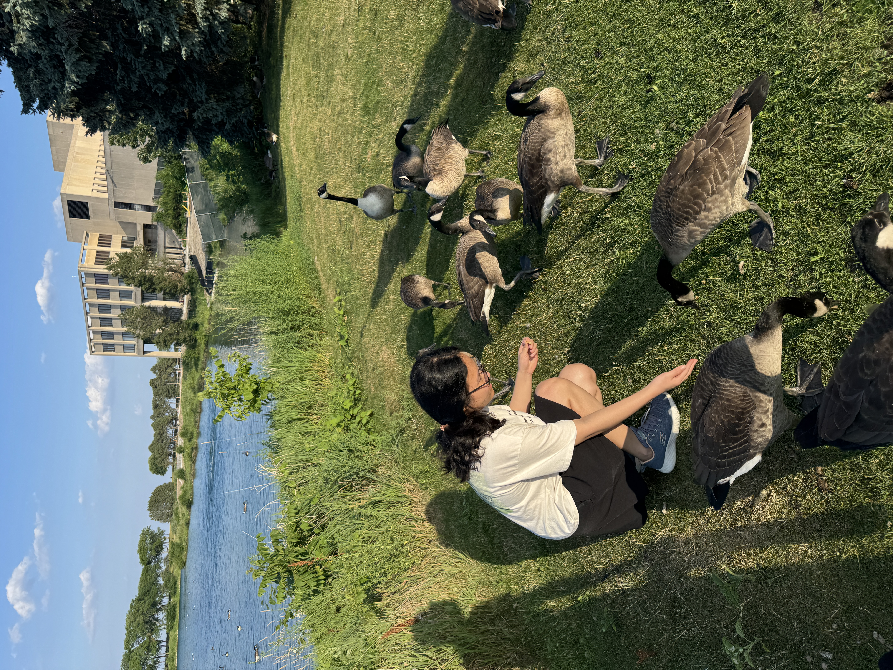

## Hi there 👋

I'm **Zihan (Lucy) Zhao**, a Master of Science student in Statistics and Data Science at Northwestern University, passionate about leveraging data and advanced models to solve complex problems. Here is my **[Resume](resume20250729.pdf)**

🌟 Recent Update: I’ve built a simple and user-friendly recommendation engine, leveraging the power of AI for product items recommendations, check it at [Recommendation Engine](https://github.com/lucyZihanZ/LLM4Rec).

* 🔭 I’m currently focused on **Graph Neural Networks** and **deep learning architectures**, with a keen interest in **cross-domain adaptation**, **transfer learning** and **Diffusion Models** tasks, especially on _Flow matching for imputation works_ where I worked with Professor Kaize Ding at [REAL Lab](https://kaize0409.github.io/Advising.html).

* 🌱 I’m continuously learning and exploring new advancements in **machine learning applications**, particularly in areas like **Natural Language Processing (NLP)**, **time-series analysis**, and **generative AI**.

* 👯 I’m looking to collaborate on projects involving **data science, AI/ML, and statistical modeling**, especially those with a focus on impact in finance, healthcare, or business solutions.

* 🤔 I’m always open to discussing **LLM fine-tuning strategies**, **data imputation techniques**, and **robust A/B testing methodologies**.

* 💬 My experience include:

  * **Self-supervised GNN recommender** for end-to-end sequential recommendation tasks ([HardGNN](https://github.com/lucyZihanZ/HardGNN)).

  * **RAG-powered LLM chatbot for healthcare applications** in healthcare and medical fields ([HealthBot](https://github.com/lucyZihanZ/HealthBot-RAG)).

  * **Credit risk modeling** and **portfolio optimization** including **fraud detection**, **return-risk management** and **quantitative research**, where I worked at the [Ernst & Young](https://www.ey.com/en_cn/services/consulting/actuarial-services).

  * **Feature engineering** and **statistical analysis** for large datasets.
   

* 📫 How to reach me: You can connect with me on [LinkedIn](https://www.linkedin.com/in/lucy-zhao-2b0225299/) or email me at ZihanZhao2024@u.northwestern.edu.

* ⚡ Fun Facts: I love animals—especially small and cute ones! Spending time with them makes me feel happy and relaxed.

  

